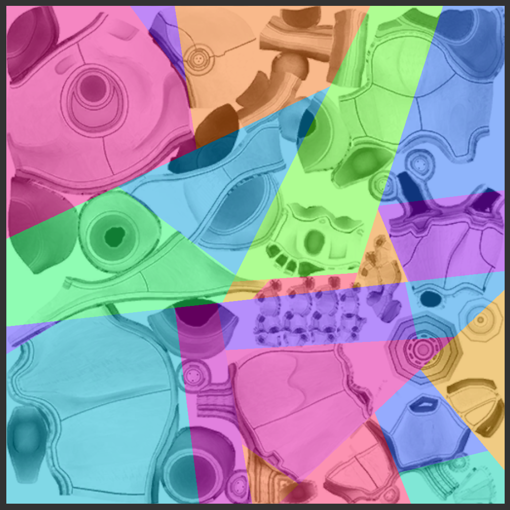
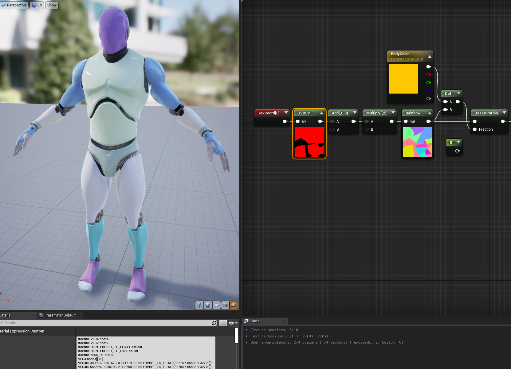
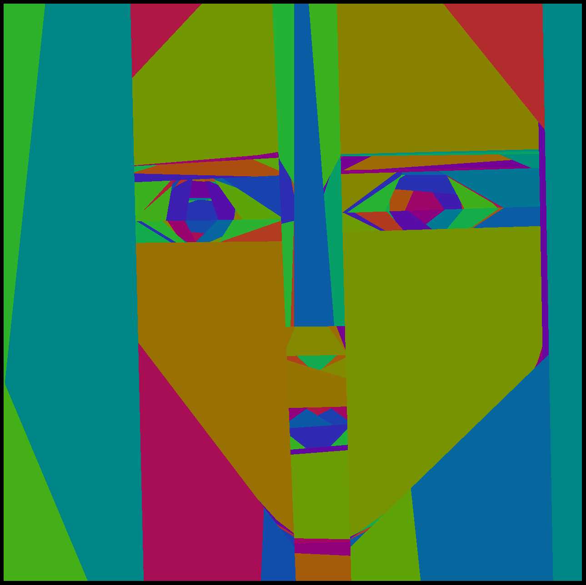

# UVBSP

Binary split partitioning of UV.

You can segment the texture islands in order to assign individual index to segments. Then you can set individual color (or any other parameter) to each of the segments. Using switch-case or as array index.
This makes possible to set an individual color scheme for each mesh, using only an array of uniform variables, without an additional RGBA masks, individual textures or vertex colors.

How to use?

Split UV islands of texture into segments:



(Less tree depth is better. Try keep amount of left and right branches the same)

Press Ctrl + Shift + E, then press G (GLSL), H(HLSL) or U(Unreal) to export code.
Code will be copied to clipboard and printed to colsole.

<details>
<summary>Code example (with my comments):</summary>

```
#define VEC4 float4
#define VEC2 float2
#define REINTERPRET_TO_FLOAT asfloat
#define REINTERPRET_TO_UINT asuint

#define MAX_DEPTH 5

// BSP tree itself starts here
VEC4 nodes[] = {
VEC4(0.380891, 0.601679, 0.111719, REINTERPRET_TO_FLOAT(32774 * 65536 + 32769)),
VEC4(0.565569, 0.330703, 2.003758, REINTERPRET_TO_FLOAT(32784 * 65536 + 32770)),
VEC4(0.250003, 0.350378, 0.471642, REINTERPRET_TO_FLOAT(32771 * 65536 + 32772)),
VEC4(0.356686, 0.462166, -0.749682, REINTERPRET_TO_FLOAT(7 * 65536 + 6)),
VEC4(0.364754, 0.175988, -6.539556, REINTERPRET_TO_FLOAT(32773 * 65536 + 9)),
VEC4(0.336963, 0.120540, -1.356440, REINTERPRET_TO_FLOAT(10 * 65536 + 11)),
VEC4(0.720663, 0.834199, 0.946730, REINTERPRET_TO_FLOAT(32775 * 65536 + 32778)),
VEC4(0.906237, 0.820784, -1.200455, REINTERPRET_TO_FLOAT(32776 * 65536 + 15)),
VEC4(0.781625, 0.923630, -2.506680, REINTERPRET_TO_FLOAT(16 * 65536 + 32777)),
VEC4(0.854241, 0.920947, 0.245704, REINTERPRET_TO_FLOAT(19 * 65536 + 18)),
VEC4(0.456197, 0.785906, -5.706050, REINTERPRET_TO_FLOAT(32779 * 65536 + 32781)),
VEC4(0.362065, 0.798427, -8.016128, REINTERPRET_TO_FLOAT(32780 * 65536 + 23)),
VEC4(0.053670, 0.666963, 0.612140, REINTERPRET_TO_FLOAT(25 * 65536 + 24)),
VEC4(0.599636, 0.682166, 0.058680, REINTERPRET_TO_FLOAT(32782 * 65536 + 32783)),
VEC4(0.527020, 0.918264, -0.703834, REINTERPRET_TO_FLOAT(28 * 65536 + 29)),
VEC4(0.803141, 0.569483, -4.655283, REINTERPRET_TO_FLOAT(30 * 65536 + 31)),
VEC4(0.709905, 0.519402, 3.122803, REINTERPRET_TO_FLOAT(32785 * 65536 + 32787)),
VEC4(0.775349, 0.480053, -2.394145, REINTERPRET_TO_FLOAT(34 * 65536 + 32786)),
VEC4(0.857827, 0.387939, 0.124695, REINTERPRET_TO_FLOAT(36 * 65536 + 37)),
VEC4(0.588878, 0.544443, 0.072449, REINTERPRET_TO_FLOAT(32788 * 65536 + 39)),
VEC4(0.509986, 0.570378, 1.077365, REINTERPRET_TO_FLOAT(41 * 65536 + 40))
};

// IMPORTANT:
// Numbers after REINTERPRET_TO_FLOAT are left_or_right indices of nodes_or_colors
// Numbers, multiplied by 65536 are left nodes, not multiplied - right
// Numbers, greater equal 32768 are nodes. Don't touch them, you can destroy the tree
// 0 ... 32767 color indices. Feel free to change numbers 1, 2, 3, 4 
// to set custom color index

const uint nodeIndexThreshold = uint(1 << 15);

uint currentIndex = uint(0);

for(int iteration = 0; iteration < MAX_DEPTH; ++iteration) {
    VEC2 pos = nodes[currentIndex].xy;
    VEC2 tangent = VEC2(nodes[currentIndex].z, 1.0);
    uint leftRight = REINTERPRET_TO_UINT(nodes[currentIndex].w); // reinterpret   
    bool isLeftPixel = dot(pos - uv, tangent) < 0.0;
    uint indexOfProperSide = isLeftPixel ? leftRight >> 16 : (leftRight & uint(0x0000ffff));

    if(indexOfProperSide >= nodeIndexThreshold) {
        currentIndex = indexOfProperSide - nodeIndexThreshold;
    } else {
        return indexOfProperSide;
    }
}
return uint(0);

// Result of function is color (or other parameter) index.
// Use it in switch-case or as array index.

// You can use it with rainbow function like this:
// const float pi_div3 = 1.047197551;
// vec3 rainbow(float val){
//   vec3 result = vec3(sin(val), sin(val + pi_div3), sin(val + pi_div3 * 2.0));
//   return result * result;
// }

```
</details>

<details>

<summary>I adjusted color indices to achieve result above:</summary>

```
VEC4(0.380891, 0.601679, 0.111719, REINTERPRET_TO_FLOAT(32774 * 65536 + 32769)),
VEC4(0.565569, 0.330703, 2.003758, REINTERPRET_TO_FLOAT(32784 * 65536 + 32770)),
VEC4(0.250003, 0.350378, 0.471642, REINTERPRET_TO_FLOAT(32771 * 65536 + 32772)),
VEC4(0.356686, 0.462166, -0.749682, REINTERPRET_TO_FLOAT(0 * 65536 + 1)),
VEC4(0.364754, 0.175988, -6.539556, REINTERPRET_TO_FLOAT(32773 * 65536 + 2)),
VEC4(0.336963, 0.120540, -1.356440, REINTERPRET_TO_FLOAT(1 * 65536 + 2)),
VEC4(0.720663, 0.834199, 0.946730, REINTERPRET_TO_FLOAT(32775 * 65536 + 32778)),
VEC4(0.906237, 0.820784, -1.200455, REINTERPRET_TO_FLOAT(32776 * 65536 + 3)),
VEC4(0.781625, 0.923630, -2.506680, REINTERPRET_TO_FLOAT(4 * 65536 + 32777)),
VEC4(0.854241, 0.920947, 0.245704, REINTERPRET_TO_FLOAT(0 * 65536 + 5)),
VEC4(0.456197, 0.785906, -5.706050, REINTERPRET_TO_FLOAT(32779 * 65536 + 32781)),
VEC4(0.362065, 0.798427, -8.016128, REINTERPRET_TO_FLOAT(32780 * 65536 + 0)),
VEC4(0.053670, 0.666963, 0.612140, REINTERPRET_TO_FLOAT(6 * 65536 + 0)),
VEC4(0.599636, 0.682166, 0.058680, REINTERPRET_TO_FLOAT(32782 * 65536 + 32783)),
VEC4(0.527020, 0.918264, -0.703834, REINTERPRET_TO_FLOAT(0 * 65536 + 7)),
VEC4(0.803141, 0.569483, -4.655283, REINTERPRET_TO_FLOAT(8 * 65536 + 0)),
VEC4(0.709905, 0.519402, 3.122803, REINTERPRET_TO_FLOAT(32785 * 65536 + 32787)),
VEC4(0.775349, 0.480053, -2.394145, REINTERPRET_TO_FLOAT(8 * 65536 + 32786)),
VEC4(0.857827, 0.387939, 0.124695, REINTERPRET_TO_FLOAT(9 * 65536 + 10)),
VEC4(0.588878, 0.544443, 0.072449, REINTERPRET_TO_FLOAT(32788 * 65536 + 10)),
VEC4(0.509986, 0.570378, 1.077365, REINTERPRET_TO_FLOAT(0 * 65536 + 0))
```
</details>
Press Ctrl + S to save project (file "test.uvbsp" to project folder).
Press Ctrl + O to open "test.uvbsp" from project folder.

# Drawing

You can try draw your art and export to ShaderToy, my example:
[https://www.shadertoy.com/view/sltBz8](https://https://www.shadertoy.com/view/sltBz8)

My friend's drawing:


Warning: number of splits is limited with GPU constant register size.

```
uniform vec4 nodes[512];
```

ToDo:

- Save/Load - WIP, you cannot edit after load, no choose path option, only "test.uvbsp" in CMake project folder.
- Figure out, why window is so laggy on drag.
- Windows support.
- Add Palette of color indices (with ImGui).
- Export as antialiased image.
- Refactor: get rid of lambdas, write "Application" class, load uniforms as plain float array.
- Read/write Json.

Done:

- Shader generator (GLSL/HLSL/Unreal) with static binary tree - done!
- Ctrl-Z - done!

Dependencies:

- SFML
